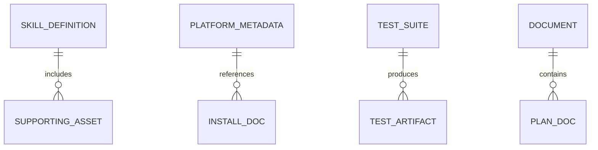

# 資料架構（基於檔案系統）

## 1. 概述

Superpowers 目前不使用關係數據庫或文檔數據庫。持久狀態是基於文件系統的。

## 2. 持久化實體

### 2.1技能定義

- 貯存：`skills/<skill-name>/SKILL.md`
- 關鍵領域：frontmatter`name`, `description`, 降價主體
- 目的：為代理商提供可執行的流程文檔

### 2.2 平臺整合元數據

- 克勞德插件元數據：`.claude-plugin/plugin.json`, `.claude-plugin/marketplace.json`
- OpenCode外掛實作：`.opencode/plugins/superpowers.js`
- Codex/OpenCode 安裝說明：`.codex/INSTALL.md`, `.opencode/INSTALL.md`

### 2.3 文件工件

- 貯存：`docs/`
- 用途：架構、規劃、平臺指南和維護記錄

### 2.4 測試工件

- 源裝置/腳本：`tests/`
- 運轉時溫度輸出：通常低於`/tmp/superpowers-tests/...`（由腳本創建）

## 3. 邏輯模式關係

## 4. 資料完整性規則

- 每個用於發現的技能目錄必須包含`SKILL.md`
- 技能正面內容應至少包括`name`和`description`
- 掛鉤/引導腳本必須發出主機執行時期望的可解析輸出格式

## 5. 保留和生命週期

- 儲存庫追蹤的檔案由 git 進行版本控制
- 臨時測試工件是短暫的，清理是由腳本管理的
- 除了 git 歷史記錄之外，不存在自動歸檔層

## 6. 未來的可擴展性

如果引入持久遙測或目錄索引，則應使用特定的模式定義和遷移過程來取代本文檔。
