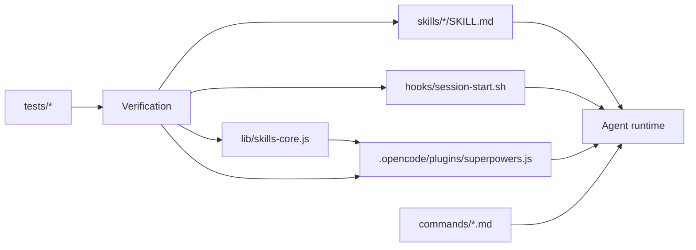
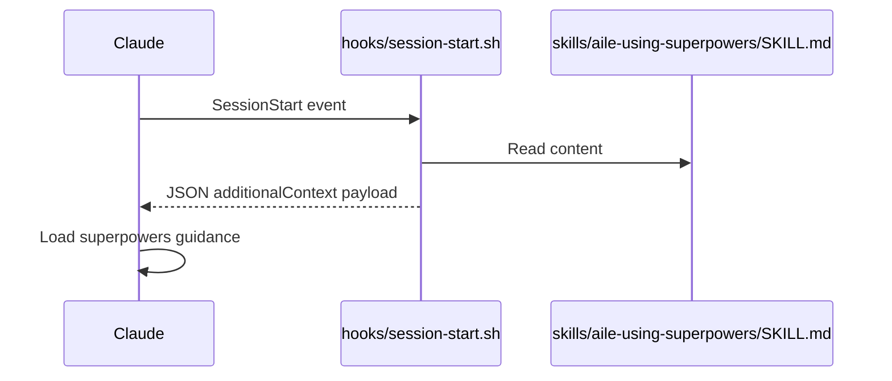
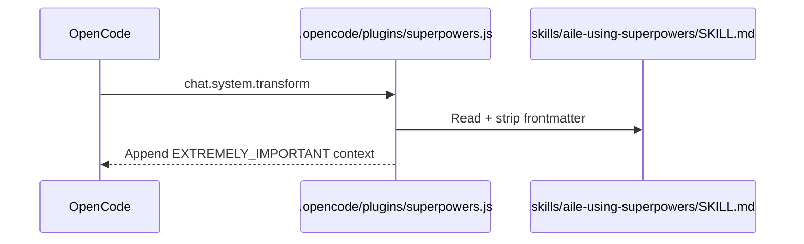

# 軟件架構設計（SAD）

## 1. 文檔元數據

- 項目：超能力
- 文檔類型：SAD（從實施回填）
- 版本：1.0
- 狀態：草案
- 最後更新: 2026-02-12

## 2.架構總結

Superpowers 是一個 **以文件和工具為導向的架構**，由以下部分組成：

1. 技能內容層（`skills/`)
2. 平臺集成層（Claude Code hooks、Codex 安裝模型、OpenCode 插件）
3. 共享庫層（`lib/skills-core.js`)
4. 質量層（多套件測試腳本`tests/`)

儲存庫不公開 HTTP 伺服器；執行時間行為主要是代理提示編排和基於檔案的發現。

## 3. 高級組件圖

## 4. 儲存庫元件模型

### 4.1技能層

- 小路：`skills/`
- 職責：提供特定工作流程的說明（集思廣益、規劃、執行、審查、調試、驗證）
- 接口：YAML frontmatter (`name`, `description`) + 降價正文
- 擴展：團隊可在同一層新增自定義 Skill（例如 `aile-*`），並在 `docs/modules/aile-skill-mapping.md` 中維護來源與增強點映射

### 4.2 平臺整合層

- 克勞德代碼：`.claude-plugin/`, `hooks/`
- 法典：`.codex/INSTALL.md`, `docs/README.codex.md`（本機發現安裝模型）
- 打開代碼：`.opencode/plugins/superpowers.js`, `.opencode/INSTALL.md`

### 4.3共享庫層

- 小路：`lib/skills-core.js`
- 職責：frontmatter 解析、遞歸技能發現、帶有陰影的技能解析、更新檢查、frontmatter 剝離

### 4.4 測試和驗證層

- 小路：`tests/`
- 套房：
  - `tests/claude-code/`：Claude CLI 行為和集成流程
  - `tests/opencode/`：插件加載和優先級解析
  - `tests/skill-triggering/`：自然提示觸發檢查
  - `tests/explicit-skill-requests/`：直接技能名稱請求檢查
  - `tests/subagent-driven-dev/`：端到端場景利用

## 5. 關鍵運行時流程

### 5.1 Claude 代碼會話引導程序

### 5.2 OpenCode 引導流程

### 5.3技能解析流程（共享邏輯）

1. 解析請求的技能名稱
2. 如果`superpowers:`前綴存在，強制核心命名空間
3. 否則喜歡個人位置而不是超能力位置
4. 退貨已解決`SKILL.md`路徑和源元數據

執行：`resolveSkillPath`在`lib/skills-core.js`

### 5.4（團隊擴展）Jira MCP 整合流程

團隊工作流可透過 MCP（Model Context Protocol）在 Skill 中聲明式調用 Jira Tool，實現 Issue 讀寫、狀態流轉與 Comment 回寫。

- 指南：`docs/guides/JIRA-MCP-INTEGRATION.md`
- 安全原則：Token 只允許來自環境變量注入，不得提交到儲存庫

## 6. 設計決策與理由

### DD-001 通過引導 CLI 發現本機技能

- 決策：盡可能使用平臺本機發現（Codex/OpenCode 現代模型）
- 理由：降低引導複雜性和特定於平臺的包裝器故障模式
- 證據：v4.2.0 發行說明和當前版本`.codex/INSTALL.md`

### DD-002 將技能保留為 markdown + frontmatter

- 決定：維持`SKILL.md`作為真理的來源
- 基本原理：人類可讀、可版本控制、輕鬆比較/審查、平臺中立

### DD-003 將共享核心與平臺包裝器分開

- 決策：保留可重複使用邏輯`lib/skills-core.js`
- 理由：DRY、維護成本更低、測試更簡單

### DD-004 腳本優先驗證

- 決定：使用基於 shell 的測試運行程式和轉錄斷言
- 理由：輕量級 CI 可移植性和直接行為驗證

## 7. 資料架構

- 存儲庫本身不使用關係數據庫或文檔數據庫。
- 持久狀態是基於檔案系統的（暫存目錄中的技能文件、文件、外掛程式清單、測試工件）。
- 詳細資料模型：`docs/database/SCHEMA.md`

## 8. 安全性和可靠性考慮

- 安全模型委託給主機平臺（Claude/Codex/OpenCode 權限系統）
- 主要存儲庫風險是執行上下文漂移和錯誤驗證
- 緩解措施：
  - 明確的驗證技巧
  - 多層測試套件
  - 重大變更的發行說明和遷移文檔

## 9. 技術債與已知差距

- 一些歷史文檔描述了已棄用的鉤子包裝器（`docs/windows/polyglot-hooks.md`）而運行時已經轉移到直接`.sh`鉤子調用
- 沒有統一的 CI 工作流程文件`.github/workflows/`然而
- 產品/業務需求是部分推斷的，需要定期維護人員驗證

## 10. 變更影響指南

- 改變於`skills/*`：更新模組文件+相關觸發測試
- 改變於`hooks/*`或者`.opencode/*`：運行集成腳本並更新平臺文檔
- 改變於`lib/skills-core.js`：運行 OpenCode 測試和任何相關回歸檢查
- 安裝文件的變更：確保遷移指南與發行說明保持一致
