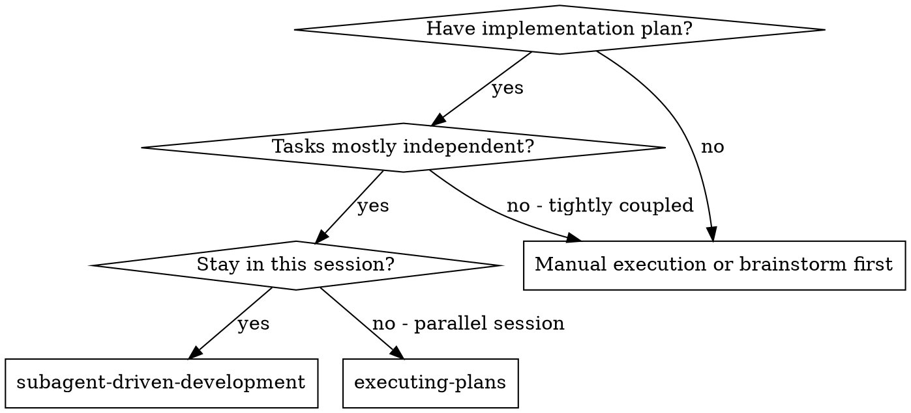
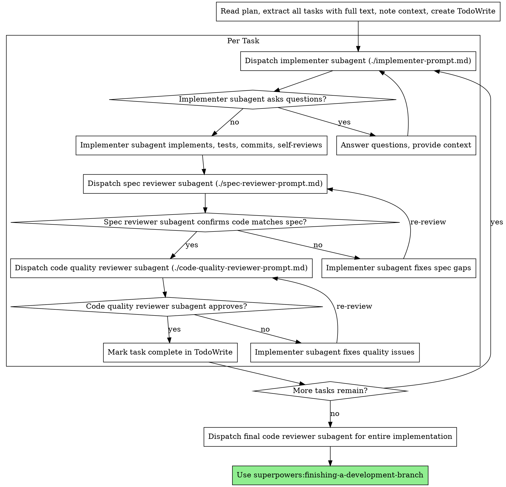

# Aile：子代理驱动开发（aile-subagent-dev）

## 概述

在团队流程中，本技能用于阶段 3 的任务执行：

- 输入：`docs/plans/{Story-Key}/analysis.md` 和`docs/plans/{Story-Key}/plan.md` 中的任务拆解
- 输出：按任务完成代码实现与验证，并通过双阶段审查把关

**核心原則：** 每個任務新鮮的子代理+兩階段審查（規格然後質量）=高質量，快速迭代

## 何時使用

## 何时使用

- 你已经有“已批准”的阶段 2 计划（`analysis.md`）



**與。執行計劃（平行會議）：**
- 同一會話（無上下文切換）
- 每個任務都有新的子代理（無上下文污染）
- 每項任務後進行兩階段審查：首先是規範合規性，然後是程式碼品質
- 更快的迭代（任務之間沒有人在循環）

## 流程



## 提示模板

- `./implementer-prompt.md`- 調度實施者子代理
- `./spec-reviewer-prompt.md`- 派遣規範合規審查員子代理
- `./code-quality-reviewer-prompt.md`- 派遣代碼質量審核員子代理

## 示例工作流程

```
You: I'm using Subagent-Driven Development to execute this plan.

[Read plan file once: docs/plans/feature-plan.md]
[Extract all 5 tasks with full text and context]
[Create TodoWrite with all tasks]

Task 1: Hook installation script

[Get Task 1 text and context (already extracted)]
[Dispatch implementation subagent with full task text + context]

Implementer: "Before I begin - should the hook be installed at user or system level?"

You: "User level (~/.config/superpowers/hooks/)"

Implementer: "Got it. Implementing now..."
[Later] Implementer:
  - Implemented install-hook command
  - Added tests, 5/5 passing
  - Self-review: Found I missed --force flag, added it
  - Committed

[Dispatch spec compliance reviewer]
Spec reviewer: ✅ Spec compliant - all requirements met, nothing extra

[Get git SHAs, dispatch code quality reviewer]
Code reviewer: Strengths: Good test coverage, clean. Issues: None. Approved.

[Mark Task 1 complete]

Task 2: Recovery modes

[Get Task 2 text and context (already extracted)]
[Dispatch implementation subagent with full task text + context]

Implementer: [No questions, proceeds]
Implementer:
  - Added verify/repair modes
  - 8/8 tests passing
  - Self-review: All good
  - Committed

[Dispatch spec compliance reviewer]
Spec reviewer: ❌ Issues:
  - Missing: Progress reporting (spec says "report every 100 items")
  - Extra: Added --json flag (not requested)

[Implementer fixes issues]
Implementer: Removed --json flag, added progress reporting

[Spec reviewer reviews again]
Spec reviewer: ✅ Spec compliant now

[Dispatch code quality reviewer]
Code reviewer: Strengths: Solid. Issues (Important): Magic number (100)

[Implementer fixes]
Implementer: Extracted PROGRESS_INTERVAL constant

[Code reviewer reviews again]
Code reviewer: ✅ Approved

[Mark Task 2 complete]

...

[After all tasks]
[Dispatch final code-reviewer]
Final reviewer: All requirements met, ready to merge

Done!
```

## 優點

**與。手動執行：**
- 子代理自然地遵循TDD
- 每個任務都有新鮮的背景（沒有混淆）
- 並行安全（子代理不幹擾）
- 子代理可以提問（工作之前和工作期間）

**與。執行計劃：**
- 同一會話（無切換）
- 持續進步（無需等待）
- 自動審查檢查點

**效率提升：**
- 無檔案讀取開銷（控制器提供全文）
- 控制器準確地規劃所需的上下文
- 子代理預先取得完整資訊
- 問題在工作開始之前（而不是之後）出現

**質量門：**
- 移交前自我審查發現問題
- 兩階段審查：規範合規性，然後是代碼質量
- 審查循環確保修復確實有效
- 符合規範可防止過度建設/建設不足
- 代碼品質確保實施良好

**成本：**
- 更多子代理呼叫（每個任務的實施者 + 2 個審閱者）
- 控制器做更多的準備工作（預先提取所有任務）
- 審查循環添加迭代
- 但儘早發現問題（比稍後調試便宜）

## 危險信號

**絕不：**
- 在使用者明確同意的情況下開始在 main/master 分支上實施
- 跳過審查（規範合規性或程式碼品質）
- 繼續處理未解決的問題
- 並行調度多個實施子代理（衝突）
- 讓子代理程式讀取計劃檔案（改為提供全文）
- 跳過場景設定上下文（子代理程式需要了解任務適合的位置）
- 忽略子代理問題（在繼續之前回答）
- 接受規範合規性“足夠接近”（規範審核者發現問題=未完成）
- 跳過審核循環（審核者發現問題 = 實施者修復 = 再次審核）
- 讓實施者自我審查取代實際審查（兩者都需要）
- **在規範合規性為✅**之前開始代碼質量審查（順序錯誤）
- 當任一審核有未解決的問題時移至下一個任務

**如果子代理提出問題：**
- 回答清楚、完整
- 如果需要，提供額外的上下文
- 不要急於實施

**如果審閱者發現問題：**
- 實施者（同一子代理）修復它們
- 審稿者再次審稿
- 重複直至獲得批准
- 不要跳過重新審核

**如果子代理任務失敗：**
- 調度帶有特定說明的修復子代理
- 不要嘗試手動修復（上下文污染）

## 一體化

**所需的工作流程技能：**
- **超級能力：使用-git-worktrees** - 必需：在開始之前設置隔離的工作區
- **超級大國：寫作計劃** - 創建該技能執行的計劃
- **superpowers:requesting-code-review** - 審閱者子代理方案的方案碼審閱模板
- **超級大國：完成開發分支** - 在完成所有任務後完成開發

**子代理應使用：**
- **超級能力：測試驅動開發** - 子代理程式遵循TDD執行每項任務

**替代工作流程：**
- **superpowers:executing-plans** - 用於端點會話而不是相同會話執行


## 执行流程

**开始时声明：**“我正在使用 aile-subagent-dev 技能按计划执行任务。”

1. 读取 `analysis.md`，提取所有任务全文与依赖
2. 建立任务列表（以依赖顺序执行）
3. 对每个任务：
   - 若任务状态为 BLOCKED，先执行“阻塞任务处理”（见下文），仅在解除阻塞后进入实现
   - 派发 implementer 子代理：只给任务全文、相关文件路径、验证命令、约束（必须 TDD）
   - implementer 完成后：自检（是否按计划、是否验证、是否有多做/少做）
   - 派发 spec reviewer：核对“计划/AC/测试”一致性
   - 派发 code quality reviewer：核对质量与安全
   - 有问题则返工并复审，直到通过
4. 所有任务完成后：派发一次全量代码审查（可选），进入交付流程

## 阻塞任务处理

遇到 BLOCKED 状态的任务时：

1. 使用 `jira_get_issue` 读取当前任务的 `blocked-by` Link。
2. 检查被依赖 Issue 的状态：
   - 若依赖 Issue 仍未完成：跳过当前任务，继续执行其他非阻塞任务。
   - 若依赖 Issue 已完成：
     - 读取其 Comment，提取接口契约/事件定义等关键信息。
     - 将契约信息写入当前任务上下文（供 implementer 与 reviewer 使用）。
     - 将当前任务状态从 BLOCKED 流转为 IN PROGRESS。
     - 按本技能流程进入 TDD 开发与后续双阶段审查。

## 危险信号

- 在未通过规格合规审查前进入代码质量审查
- 子代理未运行验证就声称完成
- 任务间并发派发多个实现子代理导致冲突
- 让子代理通读整份计划导致上下文膨胀与偏航
