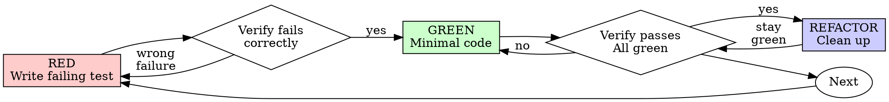

# 測試驅動開發 (TDD)

## 来源原 Skill

- 来源：superpowers TDD 能力（已迁移为 aile-only）
- 策略：保留 RED → GREEN → REFACTOR 闭环，并与团队阶段流程对齐。

## 概述

先寫測試。看著它失敗。編寫最少的程式碼即可通過。

**核心原則：** 如果你沒有看到測試失敗，你就不知道它是否測試了正確的東西。

**違反規則的字面意思就是違反規則的精神。 **

## 何時使用

**總是：**
- 新功能
- 錯誤修復
- 重構
- 行為改變

**例外（詢問你的人類夥伴）：**
- 一次性原型
- 生成的代碼
- 配置文件

想「這次跳過 TDD」嗎？停止吧。這就是合理化。

## 鐵律

```
NO PRODUCTION CODE WITHOUT A FAILING TEST FIRST
```

測試前先寫代碼？刪除它。重新開始。

**沒有例外：**
- 不要將其保留為“參考”
- 編寫測試時不要“適應”它
- 別看它
- 刪除就是刪除

實施新的測試。時期。

## 紅綠重構



### 紅色 - 寫入失敗測試

編寫一個最小的測試來顯示應該發生什麼。

<好>
```typescript
test('retries failed operations 3 times', async () => {
  let attempts = 0;
  const operation = () => {
    attempts++;
    if (attempts < 3) throw new Error('fail');
    return 'success';
  };

  const result = await retryOperation(operation);

  expect(result).toBe('success');
  expect(attempts).toBe(3);
});
```
清晰的名字，測試真實的行為，一件事
</好>

<壞>
```typescript
test('retry works', async () => {
  const mock = jest.fn()
    .mockRejectedValueOnce(new Error())
    .mockRejectedValueOnce(new Error())
    .mockResolvedValueOnce('success');
  await retryOperation(mock);
  expect(mock).toHaveBeenCalledTimes(3);
});
```
模糊的名稱，測試模擬而不是代碼
</壞>

**要求：**
- 一種行為
- 清晰的名字
- 真實程式碼（除非不可避免，否則不進行模擬）

### 驗證紅色 - 觀察失敗

**強制的。切勿跳過。 **

```bash
npm test path/to/test.test.ts
```

確認：
- 測試失敗（不是錯誤）
- 預計會出現失敗訊息
- 由於功能缺失（不是拼寫錯誤）而失敗

**測試通過？ ** 您正在測試現有行為。修復測試。

**測試錯誤？ ** 修復錯誤，重新運行，直到正確失敗。

### 綠色 - 最少代碼

編寫最簡單的程式碼來通過測試。

<好>
```typescript
async function retryOperation<T>(fn: () => Promise<T>): Promise<T> {
  for (let i = 0; i < 3; i++) {
    try {
      return await fn();
    } catch (e) {
      if (i === 2) throw e;
    }
  }
  throw new Error('unreachable');
}
```
只要夠通過即可
</好>

<壞>
```typescript
async function retryOperation<T>(
  fn: () => Promise<T>,
  options?: {
    maxRetries?: number;
    backoff?: 'linear' | 'exponential';
    onRetry?: (attempt: number) => void;
  }
): Promise<T> {
  // YAGNI
}
```
過度設計
</壞>

不要添加功能、重構其他程式碼或在測試之外進行「改進」。

### 驗證綠色 - 觀察它通過

**強制的。 **

```bash
npm test path/to/test.test.ts
```

確認：
- 測試通過
- 其他測試仍然通過
- 輸出原始（沒有錯誤、警告）

**測試失敗？ ** 修復代碼，而不是測試。

**其他測試失敗？ ** 立即修復。

### 重構 - 清理

僅綠色之後：
- 刪除重複項
- 改進名字
- 提取助手

保持測試綠色。不要添加行為。

### 重複

下一個功能的下一個失敗測試。

## 良好的測試

|品質 |好 |不好|
|---------|------|-----|
| **最小** |一件事。名字中的“和”？分開它。 |`test('validates email and domain and whitespace')` |
| **清除** |名稱描述行為 |`test('test1')` |
| **表明意圖** | 所需需要的API | 模糊了程序代碼執行|

## 為什麼訂單很重要

**“我會在之後編寫測試來驗證它是否有效”**

程式碼通過後編寫的測試立即通過。立即通過並不能證明什麼：
- 可能測試錯誤的東西
- 可能測試實施，而不是行為
- 可能會錯過您忘記的邊緣情況
- 你從未遇到過它捕獲 bug

測試優先迫使您看到測試失敗，證明它確實測試了某些東西。

**「我已經手動測試了所有邊緣情況」**

手動測試是臨時的。您認為您測試了所有內容，但：
- 沒有記錄您測試的內容
- 代碼更改後無法重新運行
- 在壓力下容易忘記案件
- “我嘗試了一下就成功了”≠全面

自動化測試是系統化的。他們每次都以同樣的方式奔跑。

**「消除X小時的工作就是浪費」**

沉沒成本謬誤。時間已經過去了。您現在的選擇：
- 使用TDD刪除並重寫（多花幾個小時，高可信度）
- 保留它並在之後添加測試（30 分鐘，低置信度，可能存在錯誤）

“浪費”是保留你不信任的代碼。沒有真正測試的工作代碼是技術債。

**「TDD 是教條主義的，務實意味著適應」**

TDD 很務實：
- 在提交之前發現錯誤（比之後調試更快）
- 防止回歸（測試立即捕獲中斷）
- 文檔行為（測試顯示如何使用程式碼）
- 啟用重構（自由更改，測試捕獲中斷）

“實用”快捷方式=生產中的調試=速度較慢。

**「達到相同目標後進行測試 - 這是精神而不是儀式」**

不。回答後測試“這有什麼作用？”測試優先回答“這應該做什麼？”

之後的測試因您的實現而存在偏差。您測試您構建的內容，而不是測試所需的內容。您驗證記住的邊緣情況，而不是發現的情況。

測試優先強制在實施之前發現邊緣情況。測試 - 驗證您記住了所有內容（您沒有記住）。

≠ TDD 經過 30 分鐘的測試。你得到了保險，失去了證明測試的工作。

## 常見的合理化理由

|對不起|現實|
|--------|---------|
| “太簡單了，無法測試”|簡單的代碼中斷。測試需要 30 秒。 |
| “之後我會測試” |測試立即通過並不能證明什麼。 |
| “達到相同目標後再進行測試” | Tests-after =“這是做什麼的？”測試優先=“這應該做什麼？” |
| “已經手動測試”|臨時性≠系統性。沒有記錄，無法重新運行。 |
| “刪除X小時是浪費”|沉沒成本謬誤。保留默認驗證的代碼是技術債。 |
| 「留作參考，先寫測驗」 |你會適應它。後面就是測試了刪除就是刪除的意思。 |
| “需要先探索”|美好的。放棄探索，從TDD開始。 |
| “努力測試=設計不清楚”|聽聽測試。難以測試=難以使用。 |
| “TDD 會讓我放慢速度” | TDD 比調試更快。務實=測試第一。 |
| “手動測試速度更快”|手冊不能證明邊緣情況。您將重新測試每個變更。 |
| “現有代碼沒有經過測試”|你正在改進它。為現有代碼添加測試。 |

## 危險信號 - 停止並重新開始

- 測試前的代碼
- 實施後測試
- 測試立即通過
- 無法解釋測試失敗的原因
- “稍後”添加測試
- 合理化“就這一次”
- “我已經手動測試過了”
- “達到相同目的後進行測試”
- “這是關於精神而不是儀式”
- “保留作為參考”或“改編現有代碼”
- “已經花了X個小時了，刪掉太浪費了”
- “TDD很教條，我很務實”
- “這是不同的，因為……”

**所有這些意味著：刪除計劃碼。從TDD開始。 **

## 示例：錯誤修復

**錯誤：** 接受空電子郵件

**紅色的**
```typescript
test('rejects empty email', async () => {
  const result = await submitForm({ email: '' });
  expect(result.error).toBe('Email required');
});
```

**驗證紅色**
```bash
$ npm test
FAIL: expected 'Email required', got undefined
```

**綠色的**
```typescript
function submitForm(data: FormData) {
  if (!data.email?.trim()) {
    return { error: 'Email required' };
  }
  // ...
}
```

**驗證綠色**
```bash
$ npm test
PASS
```

**重構**
如果需要，提取多個欄位的驗證。

## 驗證清單

在標記工作完成之前：

- [ ] 每個新函數/方法都有一個測試
- [ ] 在實施之前觀察每個測試的失敗
- [ ] 每個測驗都因預期原因而失敗（功能缺失，而非拼字錯誤）
- [ ] 編寫最少的代碼來通過每個測試
- [ ] 所有測試均通過
- [ ] 輸出原始（沒有錯誤、警告）
- [ ] 測試使用真實程式碼（僅在不可避免時才進行模擬）
- [ ] 涵蓋的邊緣情況和錯誤

無法完成所有中斷嗎？你跳過了 TDD。重新開始。

## 卡住時

|問題 |解決方案 |
|---------|----------|
|不知道如何測試|編寫想要的API。先寫斷言。詢問你的人類夥伴。 |
|測試太複雜|設計太複雜了。簡化界面。 |
|必須嘲笑一切|代碼耦合性太強。使用依賴注入。 |
|測試設定巨大|提取助手。還是很複雜？簡化設計。 |

## 偵錯集成

發現錯誤了嗎？寫一個失敗的測試來重置它。遵循TDD週期。測試證明可以修復並阻止回歸。

未經測試切勿修復錯誤。

## 測試反模式

在新增模擬或測試實用程式時，請閱讀@testing-anti-patterns.md分區常見陷阱：
- 測試模擬行為而不是真實行為
- 將僅測試方法添加到生產類中
- 在不瞭解依賴關係的情況下進行模擬

## 最終規則

```
Production code → test exists and failed first
Otherwise → not TDD
```

未經您的人類伴侶許可，也不例外。
