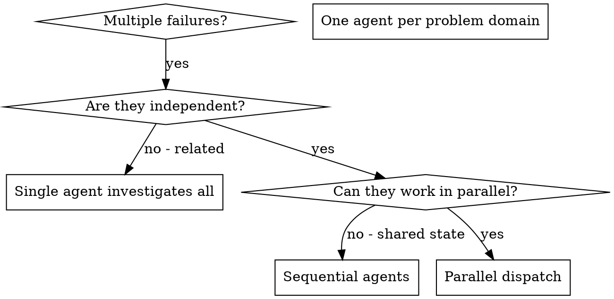

# 調度並行代理

## 概述

當您遇到多個不相關的故障（不同的測試檔案、不同的子系統、不同的錯誤）時，按順序調查它們會浪費時間。每項調查都是獨立的，可以並行進行。

**核心原則：** 每個獨立問題域調度一名代理。讓他們同時工作。

## 何時使用



**使用時間：**
- 3 個以上的測試文件因不同的根本原因而失敗
- 多個子系統獨立損壞
- 每個問題都可以在沒有其他問題的上下文的情況下被理解
- 調查之間沒有共享狀態

**請勿在以下情況下使用：**
- 故障是相關的（修復一個可能會修復其他故障）
- 需要了解完整的系統狀態
- 代理會互相干擾

## 模式

### 1. 識別獨立域

按損壞的情況對失敗進行分組：
- 文件A測試：工具解讀流程
- 檔案 B 測驗：批次完成行為
- 文件C 測試：中止功能

每個域都是獨立的 - 修復工具批准不會影響中止測試。

### 2. 創建有針對性的代理任務

每個代理獲得：
- **具體範圍：** 一個測試文件或子系統
- **明確的目標：** 通過這些測試
- **約束：** 不要更改其他代碼
- **預期輸出：** 您發現並修復的內容的摘要

### 3. 並行調度

```typescript
// In Claude Code / AI environment
Task("Fix agent-tool-abort.test.ts failures")
Task("Fix batch-completion-behavior.test.ts failures")
Task("Fix tool-approval-race-conditions.test.ts failures")
// All three run concurrently
```

### 4. 審查和整合

當代理返回時：
- 閱讀每個摘要
- 驗證修復不衝突
- 運行完整的測試套件
- 整合所有變更

## 代理提示結構

好的代理提示是：
1. **專注** - 一個明確的問題域
2. **獨立** - 理解問題所需的所有上下文
3. **具體輸出** - 代理應該返回什麼？

```markdown
Fix the 3 failing tests in src/agents/agent-tool-abort.test.ts:

1. "should abort tool with partial output capture" - expects 'interrupted at' in message
2. "should handle mixed completed and aborted tools" - fast tool aborted instead of completed
3. "should properly track pendingToolCount" - expects 3 results but gets 0

These are timing/race condition issues. Your task:

1. Read the test file and understand what each test verifies
2. Identify root cause - timing issues or actual bugs?
3. Fix by:
   - Replacing arbitrary timeouts with event-based waiting
   - Fixing bugs in abort implementation if found
   - Adjusting test expectations if testing changed behavior

Do NOT just increase timeouts - find the real issue.

Return: Summary of what you found and what you fixed.
```

## 常見錯誤

**❌ 太廣泛：**“修復所有測試”- 代理迷路
**✅具體：**“Repairagent-tool-abort.test.ts”-重點範圍

**❌沒有上下文：**“修復競爭條件” - 代理不知道在哪裡
**✅ 上下文：** 貼上錯誤訊息和測試名稱

**❌沒有限制：**代理可能會重構一切
**✅ 限制：** “不要更改生產代碼”或“僅修復測試”

**❌ 模糊輸出：** “修復它” - 你不知道發生了什麼變化
**✅ 具體：**“根本原因和更改的返回摘要”

## 何時不使用

**相關故障：** 修復一個可能會修復其他故障 - 首先一起調查
**需要完整的脈絡：**理解需要看到整個系統
**探索性調試：** 你還不知道哪裡出了問題
**共享狀態：**代理會干擾（編輯相同的文件，使用相同的資源）

## 會話中的真實範例

**場景：**重大重構後 3 個檔案出現 6 次測試失敗

**失敗：**
- agent-tool-abort.test.ts：3次失敗（時間問題）
- batch-completion-behavior.test.ts：2次失敗（工具未執行）
- tool-approval-race-conditions.test.ts：1次失敗（執行計數 = 0）

**決策：** 獨立域 - 中止邏輯與批處理完成分開，與競爭條件分開

**派遣：**
```
Agent 1 → Fix agent-tool-abort.test.ts
Agent 2 → Fix batch-completion-behavior.test.ts
Agent 3 → Fix tool-approval-race-conditions.test.ts
```

**結果：**
- 代理 1：用基於事件的等待替換逾時
- Agent 2：修改了事件結構錯誤（threadId 在錯誤的位置）
- 代理 3：添加等待異步工具執行完成

**整合：** 所有修復獨立，無衝突，全套綠色

**節省時間：** 並行解決 3 個問題與順序解決

## 主要優點

1. **並行化** - 多項調查同時發生
2. **焦點** - 每個代理的範圍都很窄，需要追蹤的上下文較少
3. **獨立** - 代理之間互不幹擾
4. **速度** - 1 時間內解決 3 個問題

## 確認

代理返回後：
1. **查看每個摘要** - 瞭解發生了什麼變化
2. **檢查衝突** - 代理程式是否編輯了相同的程式碼？
3. **運行全套** - 驗證所有修復程序是否協同工作
4. **抽查** - 代理可能會犯系統錯誤

## 現實世界的影響

來自調試會話（2025-10-03）：
- 3 個文件 6 次失敗
- 3名代理並行出動
- 所有調查同時完成
- 所有修復均已成功集成
- 代理變更之間零衝突
