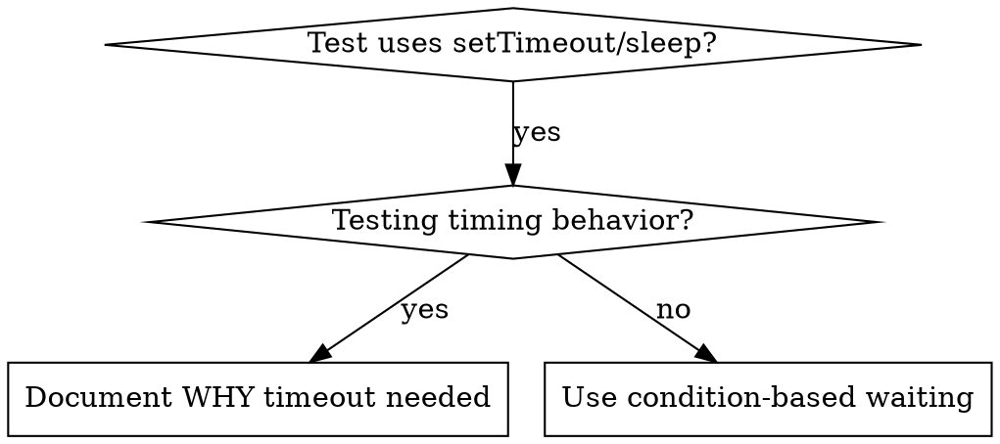

# 基於條件的等待

## 概述

不穩定的測試會假設任何延遲的時間。這會產生競爭條件，測試在快速機器上通過，但在負載或 CI 中失敗。

**核心原則：** 等待你關心的實際情況，而不是猜測需要多長時間。

## 何時使用



**使用時間：**
- 測試有任意延遲（`setTimeout`, `sleep`, `time.sleep()`)
- 測試不穩定（有時通過，在負載下失敗）
- 並行運行時測試超時
- 等待非同步操作完成

**請勿在以下情況下使用：**
- 測試實際計時行為（去抖、油門間隔）
- 如果使用任意超時，請務必記錄原因

## 核心模式

```typescript
// ❌ BEFORE: Guessing at timing
await new Promise(r => setTimeout(r, 50));
const result = getResult();
expect(result).toBeDefined();

// ✅ AFTER: Waiting for condition
await waitFor(() => getResult() !== undefined);
const result = getResult();
expect(result).toBeDefined();
```

## 快速模式

|場景 |圖案|
|----------|---------|
|等待活動 |`waitFor(() => events.find(e => e.type === 'DONE'))` |
|等待狀態|`waitFor(() => machine.state === 'ready')` |
|等待計數|`waitFor(() => items.length >= 5)` |
|等待文件 |`waitFor(() => fs.existsSync(path))` |
|複雜情況 |`waitFor(() => obj.ready && obj.value > 10)` |

## 執行

通用輪詢功能：
```typescript
async function waitFor<T>(
  condition: () => T | undefined | null | false,
  description: string,
  timeoutMs = 5000
): Promise<T> {
  const startTime = Date.now();

  while (true) {
    const result = condition();
    if (result) return result;

    if (Date.now() - startTime > timeoutMs) {
      throw new Error(`Timeout waiting for ${description} after ${timeoutMs}ms`);
    }

    await new Promise(r => setTimeout(r, 10)); // Poll every 10ms
  }
}
```

看`condition-based-waiting-example.ts`在此目錄中，以使用特定於網域的幫助程式完整實作（`waitForEvent`, `waitForEventCount`, `waitForEventMatch`）來自實際的調試會話。

## 常見錯誤

**❌ 輪詢太快：**`setTimeout(check, 1)`- 浪費CPU
**✅ 修復：** 每 10 毫秒輪詢一次

**❌ 無超時：** 如果條件從未滿足則永遠循環
**✅ 修復：** 始終包含帶有明顯錯誤的超時

**❌ 陳舊數據：** 循環之前的緩存狀態
**✅ 修復：** 在循環內呼叫 getter 以取得新數據

## 當任意超時正確時

```typescript
// Tool ticks every 100ms - need 2 ticks to verify partial output
await waitForEvent(manager, 'TOOL_STARTED'); // First: wait for condition
await new Promise(r => setTimeout(r, 200));   // Then: wait for timed behavior
// 200ms = 2 ticks at 100ms intervals - documented and justified
```

**要求：**
1. 首先等待觸發條件
2. 基於已知的時間（不是猜測）
3. 評論解釋原因

## 現實世界的影響

來自調試會話（2025-10-03）：
- 修復了 3 個檔案中的 15 個不穩定測試
- 通過率：60%→100%
- 執行時間：快 40%
- 不再有比賽條件
