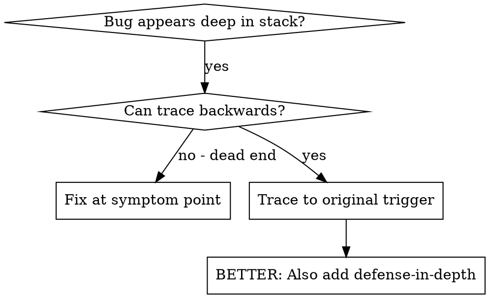
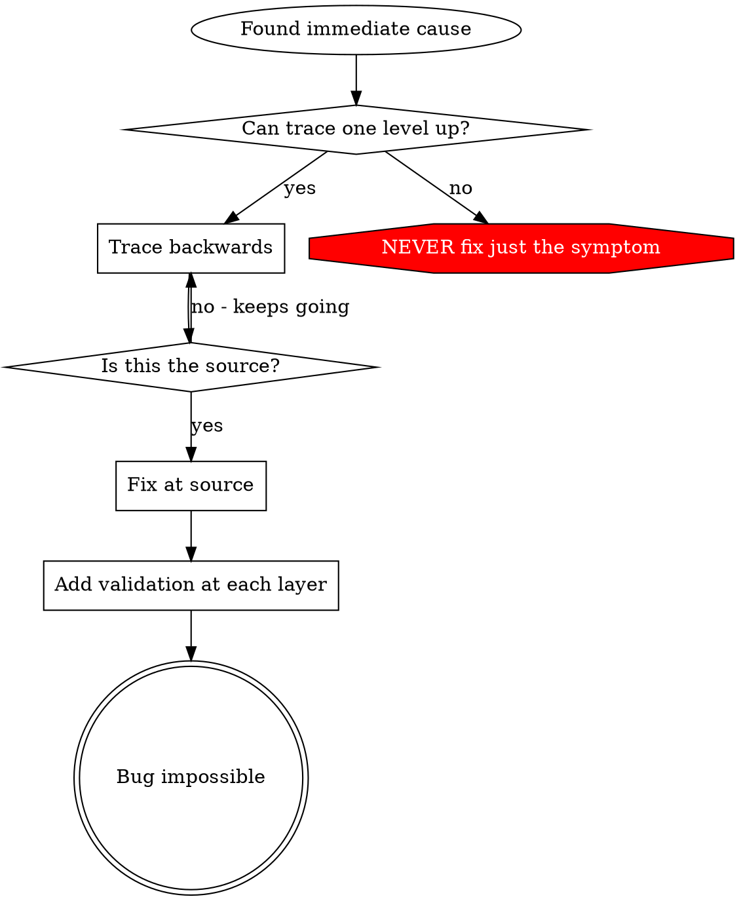

# 根本原因追蹤

## 概述

錯誤通常表現在調用堆棧的深處（git init 在錯誤的目錄中、在錯誤的位置創建文件、使用錯誤的路徑打開數據庫）。您的本能是修復錯誤出現的位置，但只是治療症狀。

**核心原理：** 透過呼叫鏈向後追蹤，直到找到原始觸發點，然後修復來源。

## 何時使用



**使用時間：**
- 錯誤發生在執行深處（而不是在入口點）
- 堆棧跟蹤顯示很長的調用鏈
- 不清楚無效數據的來源
- 需要找到哪個測試/程式碼觸發了問題

## 追蹤過程

### 1.觀察症狀
```
Error: git init failed in /Users/jesse/project/packages/core
```

### 2.找到直接原因
**什麼程式碼直接導致這個問題？ **
```typescript
await execFileAsync('git', ['init'], { cwd: projectDir });
```

### 3. 問：這叫什麼？
```typescript
WorktreeManager.createSessionWorktree(projectDir, sessionId)
  → called by Session.initializeWorkspace()
  → called by Session.create()
  → called by test at Project.create()
```

### 4. 繼續追蹤
**傳遞了什麼值？ **
- `projectDir = ''`（空字符串！）
- 空字串為`cwd`決心`process.cwd()`
- 那就是原始碼目錄！

### 5.尋找原始觸發點
**空字符串從哪裡來？ **
```typescript
const context = setupCoreTest(); // Returns { tempDir: '' }
Project.create('name', context.tempDir); // Accessed before beforeEach!
```

## 添加堆棧跟蹤

當您無法手動跟蹤時，請添加檢測：

```typescript
// Before the problematic operation
async function gitInit(directory: string) {
  const stack = new Error().stack;
  console.error('DEBUG git init:', {
    directory,
    cwd: process.cwd(),
    nodeEnv: process.env.NODE_ENV,
    stack,
  });

  await execFileAsync('git', ['init'], { cwd: directory });
}
```

**關鍵：** 使用`console.error()`在測試中（不是記錄器 - 可能不會顯示）

**運行並捕獲：**
```bash
npm test 2>&1 | grep 'DEBUG git init'
```

**分析堆棧跟蹤：**
- 尋找測試檔名
- 查找觸發呼叫的線路號碼
- 識別模式（相同的測試？相同的參數？）

## 找出哪個測試造成污染

如果測試期間出現某些情況但您不知道是哪個測試：

使用二分腳本`find-polluter.sh`在此目錄中：

```bash
./find-polluter.sh '.git' 'src/**/*.test.ts'
```

逐一執行測試，在第一個污染者處停止。使用方法參考腳本。

## 真實示例：空projectDir

**症狀：**`.git`創建於`packages/core/`(原始碼)

**追蹤鏈：**
1. `git init`跑進`process.cwd()`← 空cwd參數
2. 使用空的projectDir呼叫WorktreeManager
3. Session.create() 提交空字符串
4. 測試訪問`context.tempDir`在每個之前
5. setupCoreTest() 返回`{ tempDir: '' }`最初

**根本原因：** 頂級變數初始化存取空值

**修復：**使 tempDir 成為 getter，如果在 beforeEach 之前訪問則發送異常

**還添加了縱深防禦：**
- 第一層：Project.create() 驗證目錄
- 第2層：WorkspaceManager 驗證不為空
- 第三層：NODE_ENV 防護拒絕 tmpdir 以外的 git init
- 第4層：git init之前的追蹤堆疊日誌記錄

## 關鍵原理



**切勿僅修復錯誤出現的位置。 **回溯以找到原始觸發器。

## 堆疊追蹤技巧

**在測試中：** 使用`console.error()`不是記錄器 - 記錄器可能被抑制
**操作前：** 在危險操作之前記錄，而不是在失敗之後記錄
**包含上下文：**目錄、cwd、環境變數、時間
**捕獲堆棧：**`new Error().stack`顯示完整的呼叫鏈

## 現實世界的影響

來自調試會話（2025-10-03）：
- 透過5級追蹤找到根本原因
- 在源頭修復（吸氣劑驗證）
- 增加了4層防禦
- 1847項測試通過，零污染
