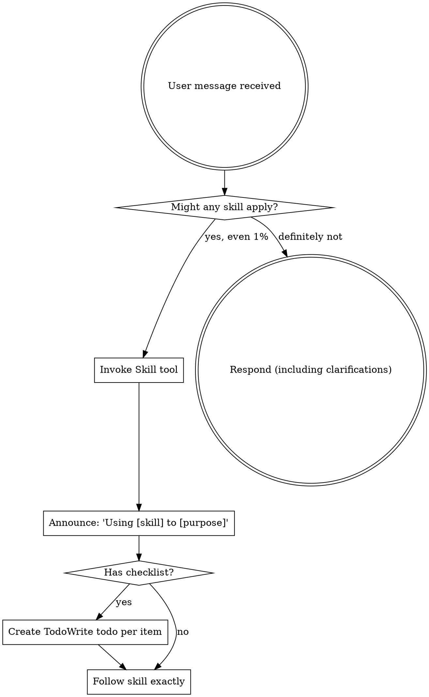

<EXTREMELY-IMPORTANT>
如果你認為某個技能有哪怕 1% 的機率適用於當前任務，你就**必須**先調用該技能。

如果有技能適用，你**沒有選擇權**，必須使用它。

這不是建議，而是硬性規則。不要先動手再補技能。
</EXTREMELY-IMPORTANT>

## 如何獲取技能

**在克勞德代碼中：** 使用`Skill`工具。當您調用一項技能時，其內容將被加載並呈現給您 - 直接遵循它。切勿對技能文件使用讀取工具。

**在其他環境中：** 檢查您的平臺文件以瞭解如何載入技能。

# 使用技巧

## 規則

**在任何回應或操作之前，先調用相關或被點名請求的技能。**  
即使某項技能只有 1% 可能適用，也要先調用檢查。  
如果調用後確認不適用，可以不使用；但不能跳過調用步驟。

## 危險信號

這些想法意味著停止——你正在合理化：

|思想|現實|
|---------|---------|
| “這只是一個簡單的問題”|問題就是任務。檢查技能。 |
| “我首先需要更多背景信息” |技能檢查先於澄清問題。 |
| 「讓我先探索一下程式碼庫」|技能告訴您如何探索。先檢查一下。 |
| “我可以快速檢查 git/files”|文件缺乏上下文上下文。檢查技巧。 |
| “我先收集一下信息”|技能告訴您如何收集信息。 |
| 「這不需要正式的技能」 |如果存在技能，就使用它。 |
| “我記得這個技能”|技能不斷發展。閱讀當前版本。 |
| 「這不算是任務」|行動=任務。檢查技能。 |
| 「技能太過分了」|簡單的事情變得複雜。使用它。 |
| “我先做一件事” |做任何事情之前先檢查一下。 |
| 「這感覺很有成效」 |無紀律的行動會浪費時間。技能可以防止這種情況發生。 |
| 「我知道這代表什麼」 | 瞭解概念≠使用技能。調用它。 |

## 技能優先

當可以應用多種技能時，請使用以下順序：

1. **首先是流程技能**（頭腦風暴、調試）——這些決定瞭如何處理任務
2. **實施技巧第二**（前端設計、mcp-builder）-這些指導執行

「讓我們眼前X」→先集思廣益，然後是實作技巧。
“修復此錯誤”→ 首先調試，然後再進行特定領域的技能。

## 技能類型

**嚴格**（TDD、調試）：嚴格遵循。不要適應紀律。

**靈活**（模式）：根據具體情況調整原則。

技能本身會告訴你哪個。

## 用戶說明

說明說的是“做什麼”，而不是“如何做”。 「新增 X」或「修復 Y」並不意味著跳過工作流程。
