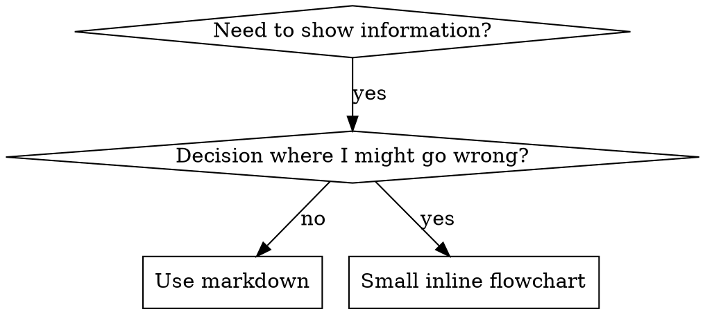

# 寫作技巧

## 概述

**寫作技巧是將測試驅動開發應用於流程文件。 **

**個人技能位於特定於代理商的目錄中（`~/.claude/skills`對於克勞德·代碼，`~/.agents/skills/`用於食品法典）**

您編寫測試案例（子代理程式的壓力場景），觀察它們失敗（基線行為），編寫技能（文件），觀察測試通過（代理遵守），然後重構（關閉漏洞）。

**核心原則：** 如果你沒有看到代理在沒有技能的情況下失敗，你就不知道該技能是否教導了正確的東西。

**所需背景：** 在使用此技能之前，您必須瞭解超能力：測試驅動開發。該技能定義了基本的紅-綠-重構循環。該技能使 TDD 適應文檔。

**官方指導：** Anthropic 的官方技能創作最佳實踐，請參閱anthropic-best-practices.md。本文檔提供了額外的模式和指南，以補充該技能中以 TDD 為中心的方法。

## 什麼是技能？

**技能**是經過驗證的技術、模式或工具的參考指南。技能幫助未來的克勞德實例找到並應用有效的方法。

**技能是：** 可重複使用的技術、模式、工具、參考指南

**技能不是：** 關於您如何解決一次問題的敘述

## TDD 技能映射

| TDD 概念 |技能創造 |
|-------------|----------------|
| **測試用例** |帶有子代理的壓力場景 |
| **生產代碼** |技能文檔(SKILL.md) |
| **測試失敗（紅色）** |代理在沒有技能的情況下違反規則（基線）|
| **測試通過（綠色）** |代理人遵守現有技能 |
| **重構** |堵住漏洞，同時保持合規性 |
| **先寫測試** |在編寫技能之前運行基線場景 |
| **看著它失敗** |記錄代理人所使用的準確合理化|
| **最少程式碼** |編寫解決這些特定違規行為的技能 |
| **看著它過去** |驗證代理現在是否符合要求 |
| **重構週期** |尋找新的合理化→阻塞→重新驗證|

整個技能創建過程遵循紅-綠-重構。

## 何時創建技能

**創建時間：**
- 技術對你來說並不直觀明顯
- 您可以在項目中再次引用它
- 模式適用範圍廣泛（不特定於項目）
- 其他人會受益

**不要為以下目的創建：**
- 免洗解決方案
- 其他地方有詳細記錄的標準實踐
- 項目特定約定（放入CLAUDE.md）
- 機械約束（如果可以透過正規表示式/驗證強制執行，則將其自動化 - 保存判斷呼叫的文件）

## 技能類型

### 科技
具體方法和步驟（基於條件的等待、根本原因追蹤）

### 圖案
思考問題的方式（帶有標誌的扁平化、測試不變量）

### 參考
API文檔、語法指南、工具文檔（office文檔）

## 目錄結構


```
skills/
  skill-name/
    SKILL.md              # Main reference (required)
    supporting-file.*     # Only if needed
```

**扁平命名空間** - 所有技能都集中在一個可搜尋命名空間中

**單獨的文件：**
1. **大量參考**（100 多行）- API 文檔，全面的語法
2. **可重複使用工具** - 腳本、實用程式、模板

**保持內聯：**
- 原理和概念
- 程式碼模式（< 50 行）
- 其他一切

## SKILL.md結構

**前端問題 (YAML)：**
- 僅支援兩個欄位：`name`和`description`
- 總共最多 1024 個字符
- `name`：僅使用字母、數字和連字符（無括號、特殊字符）
- `description`：第三人稱，僅描述何時使用（而不是它的作用）
  - 從「Use when...」開始，專注於觸發條件
  - 包括具體症狀、情況和背景
  - **永遠不要總結技能的流程或工作流程**（請參閱 CSO 部分以瞭解原因）
  - 盡可能保持在 500 個字元以內

```markdown
---
name: Skill-Name-With-Hyphens
description: Use when [specific triggering conditions and symptoms]
---

# Skill Name

## Overview
What is this? Core principle in 1-2 sentences.

## When to Use
[Small inline flowchart IF decision non-obvious]

Bullet list with SYMPTOMS and use cases
When NOT to use

## Core Pattern (for techniques/patterns)
Before/after code comparison

## Quick Reference
Table or bullets for scanning common operations

## Implementation
Inline code for simple patterns
Link to file for heavy reference or reusable tools

## Common Mistakes
What goes wrong + fixes

## Real-World Impact (optional)
Concrete results
```


## 克勞德搜尋優化 (CSO)

**發現的關鍵：**未來的克勞德需要找到你的技能

### 1.豐富的描述字段

**目的：** 克勞德閱讀描述來決定為給定任務加載哪些技能。讓它回答：“我現在應該讀這個技能嗎？”

**格式：** 以“Use when...”開頭，重點關注觸發條件

**關鍵：描述=何時使用，而不是技能的作用**

描述應僅描述觸發條件。不要在描述中總結技能的流程或工作流程。

**為什麼這很重要：** 測試顯示，當描述總結了技能的工作流程時，克勞德可能會遵循描述而不是閱讀完整的技能內容。儘管該技能的流程圖清楚地顯示了兩次審查（規範合規性然後是代碼質量），但“任務之間的代碼審查”的描述導致克勞德進行了一次審查。

當描述改為“在執行具有獨立任務的實施計劃時使用”（沒有工作流程摘要）時，克勞德正確地閱讀了流程圖並遵循了兩階段審核流程。

**陷阱：** 總結工作流程的描述創建了克勞德將採取的捷徑。技能主體變成了克勞德跳過的文檔。

```yaml
# ❌ BAD: Summarizes workflow - Claude may follow this instead of reading skill
description: Use when executing plans - dispatches subagent per task with code review between tasks

# ❌ BAD: Too much process detail
description: Use for TDD - write test first, watch it fail, write minimal code, refactor

# ✅ GOOD: Just triggering conditions, no workflow summary
description: Use when executing implementation plans with independent tasks in the current session

# ✅ GOOD: Triggering conditions only
description: Use when implementing any feature or bugfix, before writing implementation code
```

**內容：**
- 使用顯示該技能適用的具體觸發因素、症狀和情況
- 描述*問題*（競爭條件、不一致的行為）而不是*特定於語言的症狀*（setTimeout、睡眠）
- 保持觸發器與技術無關，除非技能本身是特定於技術的
- 如果技能是特定於技術的，請在觸發器中明確說明
- 以第三人稱書寫（注入系統提示符）
- **永遠不要總結技能的流程或工作流程**

```yaml
# ❌ BAD: Too abstract, vague, doesn't include when to use
description: For async testing

# ❌ BAD: First person
description: I can help you with async tests when they're flaky

# ❌ BAD: Mentions technology but skill isn't specific to it
description: Use when tests use setTimeout/sleep and are flaky

# ✅ GOOD: Starts with "Use when", describes problem, no workflow
description: Use when tests have race conditions, timing dependencies, or pass/fail inconsistently

# ✅ GOOD: Technology-specific skill with explicit trigger
description: Use when using React Router and handling authentication redirects
```

### 2. 關鍵詞覆蓋率

使用克勞德會搜尋的字詞：
- 錯誤消息：“掛鉤超時”、“ENOTEMPTY”、“競爭條件”
- 症狀：“片狀”、“懸掛”、“殭屍”、“污染”
- 同義詞：“超時/掛起/凍結”、“清理/拆卸/afterEach”
- 工具：實際指令、函式庫名稱、檔案類型

### 3. 描述性命名

**使用主動語態，動詞在前：**
- ✅ `creating-skills`不是`skill-creation`
- ✅ `condition-based-waiting`不是`async-test-helpers`

### 4. 代幣效率（關鍵）

**問題：**每次對話中都會包含入門和經常引用的技能。每個令牌都很重要。

**目標字數：**
- 入門工作流程：每個 <150 字
- 常用技能：總字數<200
- 其他技能：<500字（仍要簡潔）

**技術：**

**將詳細信息移至工具幫助：**
```bash
# ❌ BAD: Document all flags in SKILL.md
search-conversations supports --text, --both, --after DATE, --before DATE, --limit N

# ✅ GOOD: Reference --help
search-conversations supports multiple modes and filters. Run --help for details.
```

**使用交叉引用：**
```markdown
# ❌ BAD: Repeat workflow details
When searching, dispatch subagent with template...
[20 lines of repeated instructions]

# ✅ GOOD: Reference other skill
Always use subagents (50-100x context savings). REQUIRED: Use [other-skill-name] for workflow.
```

**壓縮範例：**
```markdown
# ❌ BAD: Verbose example (42 words)
your human partner: "How did we handle authentication errors in React Router before?"
You: I'll search past conversations for React Router authentication patterns.
[Dispatch subagent with search query: "React Router authentication error handling 401"]

# ✅ GOOD: Minimal example (20 words)
Partner: "How did we handle auth errors in React Router?"
You: Searching...
[Dispatch subagent → synthesis]
```

**消除冗餘：**
- 不要重複交叉引用技能中的內容
- 不要解釋從命令中顯而易見的內容
- 請勿包含同一模式的多個範例

**確認：**
```bash
wc -w skills/path/SKILL.md
# getting-started workflows: aim for <150 each
# Other frequently-loaded: aim for <200 total
```

**根據您所做的事情或核心見解來命名：**
- ✅ `condition-based-waiting` > `async-test-helpers`
- ✅ `using-skills`不是`skill-usage`
- ✅ `flatten-with-flags` > `data-structure-refactoring`
- ✅ `root-cause-tracing` > `debugging-techniques`

**動名詞 (-ing) 適用於流程：**
- `creating-skills`, `testing-skills`, `debugging-with-logs`
- 活躍，描述您正在採取的行動

### 4. 交叉參考其他技能

**在撰寫引用其他技能的文件時：**

僅使用技能名稱，並帶有明確的要求標記：
- ✅ 好：`**REQUIRED SUB-SKILL:** Use superpowers:test-driven-development`
- ✅ 好：`**REQUIRED BACKGROUND:** You MUST understand superpowers:systematic-debugging`
- ❌ 壞：`See skills/testing/test-driven-development`（不清楚是否需要）
- ❌ 壞：`@skills/testing/test-driven-development/SKILL.md`（力負荷，燒傷情況）

**為什麼沒有@連結：**`@`語法立即強制加載文件，在需要它們之前消耗 200k+ 上下文。

## 流程圖使用



**流程圖僅用於：**
- 不明顯的決策點
- 您可能會過早停止的處理循環
- 「何時使用 A 與 B」決策

**切勿將流程圖用於：**
- 參考資料 → 表格、列表
- 程式碼範例 → Markdown 區塊
- 線性指令 → 編號列表
- 無語義的標籤（step1、helper2）

有關 graphviz 樣式規則，請參閱@graphviz-conventions.dot。

**為您的人類伴侶視覺化：** 使用`render-graphs.js`在此目錄中將技能流程圖渲染為 SVG：
```bash
./render-graphs.js ../some-skill           # Each diagram separately
./render-graphs.js ../some-skill --combine # All diagrams in one SVG
```

## 程式碼範例

**一個優秀的例子勝過許多平庸的例子**

選擇最相關的語言：
- 測試技術 → TypeScript/JavaScript
- 系統調試 → Shell/Python
- 數據處理 → Python

**好例子：**
- 完整且可運行
- 評論很好，解釋了為什麼
- 來自真實場景
- 清晰顯示圖案
- 準備好適應（不是通用模板）

**不：**
- 以 5 種以上語言實施
- 創建填空模板
- 編寫人為的例子

你很擅長移植——一個很好的例子就夠了。

## 文件組織

### 自成一體的技能
```
defense-in-depth/
  SKILL.md    # Everything inline
```
時間：所有內容都合適，不需要大量參考

### 使用可重複使用工具的技能
```
condition-based-waiting/
  SKILL.md    # Overview + patterns
  example.ts  # Working helpers to adapt
```
何時：工具是可重用的代碼，而不僅僅是敘述性的

### 具有大量參考的技能
```
pptx/
  SKILL.md       # Overview + workflows
  pptxgenjs.md   # 600 lines API reference
  ooxml.md       # 500 lines XML structure
  scripts/       # Executable tools
```
何時：參考資料對內聯來說太大

## 鐵律（與 TDD 相同）

```
NO SKILL WITHOUT A FAILING TEST FIRST
```

這適用於新技能和對現有技能的編輯。

在測試之前先寫技能？刪除它。重新開始。
不測試就編輯技能？同樣違規。

**沒有例外：**
- 不適合“簡單添加”
- 不是為了“只是添加一個部分”
- 不適用於“文件更新”
- 不要將未經測試的更改保留為“參考”
- 運行測試時不要“適應”
- 刪除就是刪除

**所需背景：** 超級能力：測試驅動開發技能解釋了為什麼這很重要。同樣的原則也適用於文檔。

## 測試所有技能類型

不同的技能類型需要不同的測試方法：

### 紀律執行技能（規則/要求）

**示例：** TDD、完成前驗證、編碼前設計

**測試用：**
- 學術問題：他們理解規則嗎？
- 壓力場景：他們在壓力下服從嗎？
- 多重壓力疊加：時間+沉沒成本+疲憊
- 識別合理化並添加顯式計數器

**成功標準：** 特工在最大壓力下遵循規則

### 技術技能（操作指南）

**範例：** 基於條件的等待、根本原因追蹤、防禦性編程

**測試用：**
- 應用場景：他們能正確應用該技術嗎？
- 變化場景：它們是否處理邊緣情況？
- 缺失信息測試：說明是否存在空白？

**成功標準：** 代理成功地將技術應用於新場景

### 模式技能（心智模型）

**示例：** 降低複雜性、信息隱藏概念

**測試用：**
- 辨識場景：他們能辨識模式何時應用嗎？
- 應用場景：他們能使用心智模型嗎？
- 反例：他們知道什麼時候不應該申請嗎？

**成功標準：** 代理正確識別何時/如何應用模式

### 參考技能（文檔/API）

**範例：** API 文件、命令參考、庫指南

**測試用：**
- 檢索場景：他們能找到正確的資訊嗎？
- 應用場景：他們能正確使用他們發現的東西嗎？
- 差距測試：是否涵蓋常見用例？

**成功標準：** 代理找到並正確應用參考信息

## 跳過測試的常見理由

|對不起|現實|
|--------|---------|
| 「功力明顯清晰」|您清楚≠其他代理人清楚。測試一下。 |
| “這只是一個參考”|參考文獻可能有空白、不清楚的部分。測試檢索。 |
| “測試是矯枉過正”|未經測試的技能存在問題。總是。 15 分鐘測試可節省數小時。 |
|「我會測試是否有問題」|問題=特工無法使用技能。部署之前進行測試。 |
| “測試太繁瑣”|測試比調試生產中的不良技能要簡單得多。 |
| 「我相信這很好」 |過度自信會帶來問題。無論如何都要測試一下。 |
| “學術評審就夠了”|閱讀≠使用。測試應用場景。 |
| “沒有時間測試” |部署未經測試的技能會浪費更多時間來修復它。 |

**所有這些意味著：在部署之前進行測試。無一例外。 **

## 反對合理化的防彈技巧

執行紀律的技能（如 TDD）需要抵制合理化。代理人很聰明，在壓力下會發現漏洞。

**心理學註：** 瞭解說服技巧為何有效可以幫助您有系統地應用它們。有關權威、承諾、稀缺性、社會證明和統一原則的研究基金會（Cialdini，2021；Meincke et al.，2025）請參閱persuasion-principles.md。

### 明確堵住每一個漏洞

不要只是陳述規則 - 禁止特定的解決方法：

<壞>
```markdown
Write code before test? Delete it.
```
</壞>

<好>
```markdown
Write code before test? Delete it. Start over.

**No exceptions:**
- Don't keep it as "reference"
- Don't "adapt" it while writing tests
- Don't look at it
- Delete means delete
```
</好>

### 解決「精神與文字」的爭論

儘早添加基本原則：

```markdown
**Violating the letter of the rules is violating the spirit of the rules.**
```

這切斷了整個階級的「我追隨精神」的合理化。

### 建立合理化表

從基線測試中獲取合理性（請參閱下面的測試部分）。代理人提出的每一個藉口都在表中：

```markdown
| Excuse | Reality |
|--------|---------|
| "Too simple to test" | Simple code breaks. Test takes 30 seconds. |
| "I'll test after" | Tests passing immediately prove nothing. |
| "Tests after achieve same goals" | Tests-after = "what does this do?" Tests-first = "what should this do?" |
```

### 建立危險訊號列表

讓代理商在合理化時可以輕鬆自檢：

```markdown
## Red Flags - STOP and Start Over

- Code before test
- "I already manually tested it"
- "Tests after achieve the same purpose"
- "It's about spirit not ritual"
- "This is different because..."

**All of these mean: Delete code. Start over with TDD.**
```

### 更新 CSO 的違規症狀

加入描述：當您即將違反規則時的症狀：

```yaml
description: use when implementing any feature or bugfix, before writing implementation code
```

## 技能紅綠重構

遵循 TDD 週期：

### 紅色：寫入失敗測試（基線）

在沒有技能的情況下使用子代理運行壓力場景。記錄確切的行為：
- 他們做出了什麼選擇？
- 他們使用了什麼合理化理由（逐字）？
- 哪些壓力引發了違規行為？

這就是“觀察測試失敗”——在編寫技能之前，您必須瞭解代理自然會做什麼。

### 綠色：寫出最低限度的技能

寫出解決這些具體合理化的技巧。不要為假設案例添加額外的內容。

運用技巧運行相同的場景。代理現在應該遵守。

### 重構：堵住漏洞

代理找到新的合理化？添加顯式計數器。重新測試直到防彈。

**測試方法：** 請參閱@testing-skills-with-subagents.md以瞭解完整的測試方法：
- 如何寫壓力場景
- 壓力類型（時間、沉沒成本、權威、疲憊）
- 系統地堵塞漏洞
- 元測試技術

## 反模式

### ❌ 敘述例子
“在 2025 年 10 月 3 日會話中，我們發現空的 projectDir 導致......”
**為什麼不好：** 太具體，不可重用

### ❌ 多語淡化
example-js.js、example-py.py、example-go.go
**為什麼不好：** 品質平庸，維持負擔重

### ❌ 流程圖中的代碼
```dot
step1 [label="import fs"];
step2 [label="read file"];
```
**為什麼不好：** 無法複製貼上，難以閱讀

### ❌ 通用標籤
助手 1、助手 2、步驟 3、模式 4
**為什麼不好：** 標籤應該具有語義意義

## 停止：在轉向下一個技能之前

**寫完任何技能後，您必須停止並完成部署程序。 **

**不要：**
- 批量創建多個技能，無需測試每個技能
- 在驗證目前技能之前移至下一個技能
- 跳過測試，因為“批處理更高效”

**下面的部署清單對於每項技能都是強制性的。 **

部署未經測試的技能=部署未經測試的程式碼。這是違反品質標準的。

## 技能創建清單（TDD 改編）

**重要提示：使用 TodoWrite 為下面的每個清單項目建立待辦事項。 **

**紅色階段 - 寫入失敗測試：**
- [ ] 創建壓力場景（紀律技能的 3+ 組合壓力）
- [ ] 無需技能即可運行場景 - 逐字記錄基線行為
- [ ] 識別合理化/失敗的模式

**綠色階段 - 寫出最低技能：**
- [ ] 名稱僅使用字母、數字、連字符（無括號/特殊字符）
- [ ] YAML frontmatter 僅包含名稱和描述（最多 1024 個字符）
- [ ] 描述以「何時使用」開頭，並包含特定的觸發因素/症狀
- [ ] 以第三人稱書寫的描述
- [ ] 搜索關鍵詞（錯誤、症狀、工具）
- [ ] 清晰概述與核心原則
- [ ] 解決 RED 中確定的特定基線故障
- [ ] 程式碼內聯或連結到單獨的文件
- [ ] 一個很好的例子（非多語言）
- [ ] 使用技能運行場景 - 驗證代理現在是否遵守

**重構階段 - 堵住漏洞：**
- [ ] 從測試中找出新的合理性
- [ ] 增加明確的指示物（如果是紀律技能）
- [ ] 根據所有測試迭代構建合理化表
- [ ] 建立危險訊號列表
- [ ] 重新測試至防彈

**質量檢查：**
- [ ] 僅當決策不明顯時才使用小流程圖
- [ ] 快速參考表
- [ ] 常見錯誤部分
- [ ] 不講故事
- [ ] 支援文件僅供工具或大量參考

**部署：**
- [ ] 將技能提交至 git 並推送到您的 fork（如果已配置）
- [ ] 考慮通過公關做出貢獻（如果廣泛有用）

## 發現工作流程

未來的克勞德如何找到你的技能：

1. **遇到問題**（“測試不穩定”）
3. **找到技能**（描述匹配）
4. **掃描概述**（這相關嗎？）
5. **讀取模式**（快速參考表）
6. **載入範例**（僅在實作時）

**針對此流程進行優化** - 儘早且經常放置可搜索術語。

## 底線

**建立技能是流程文件的 TDD。 **

同樣的鐵律：沒有經過考驗就沒有技能。
相同的循環：紅色（基線）→綠色（編寫技巧）→REFACTOR（關閉漏洞）。
相同的好處：更好的品質、更少的驚喜、萬無一失的結果。

如果您在程式碼方面遵循 TDD，那麼在技能方面也遵循 TDD。這與套用於文件的規則相同。
